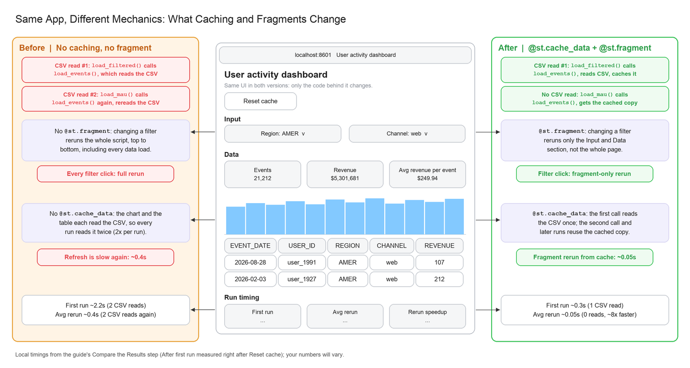

# Speed Up Streamlit Apps with Caching and Fragments

Companion repo for the Snowflake guide [Speed Up Streamlit Apps with Caching and Fragments](https://www.snowflake.com/en/developers/guides/speed-up-streamlit-apps-with-caching-and-fragments/).

A Streamlit app is easy to build until users start clicking filters. Every click reruns the whole script from top to bottom, and every data load runs again, even when nothing about the data changed. In this demo, the table and the chart each load the data, so the uncached app reads it twice on every click.

Two small changes fix this. `@st.cache_data` loads the data once and reuses it, and `@st.fragment` limits a filter click to rerunning just the filter section. In testing, reruns dropped from ~0.4s to ~0.05s locally, and from ~0.73s to ~0.017s in Streamlit in Snowflake.



## What's in this repo

| Path | Contents |
|---|---|
| `before/streamlit_app.py` | A first-draft dashboard: no caching, no fragment |
| `after/streamlit_app.py` | The same file with `@st.cache_data` on the three data loads and `@st.fragment` on the filter section |
| `data/user_events.csv` | 200k synthetic user events (about 5% have no region) |
| `setup.sql` | Loads the CSV into `USER_EVENTS_DEMO` and creates both apps in Streamlit in Snowflake |

The two apps differ only by the decorators, so this shows every change:

```bash
diff before/streamlit_app.py after/streamlit_app.py
```

## Run locally

```bash
git clone https://github.com/Snowflake-Labs/sfguide-speed-up-streamlit-apps-with-caching-and-fragments.git
cd sfguide-speed-up-streamlit-apps-with-caching-and-fragments
pip install -r after/requirements.txt
streamlit run before/streamlit_app.py --server.port 8601
streamlit run after/streamlit_app.py --server.port 8602
```

Each app has a **Reset cache** button and a **Run timing** panel. Click **Reset cache**, change the Region filter a few times, and compare the two apps.

## Deploy to Streamlit Community Cloud

Fork this repo, then in [Streamlit Community Cloud](https://share.streamlit.io) create an app from your fork with the main file path `after/streamlit_app.py` (or `before/streamlit_app.py`). It installs the packages in that folder's `requirements.txt` and reads the bundled CSV.

## Deploy to Streamlit in Snowflake

In Streamlit in Snowflake, `load_events()` queries a `USER_EVENTS_DEMO` table through the app's Snowpark session instead of reading the CSV. `load_filtered()` and `load_mau()` don't change. The apps run on the container runtime and need an external access integration that allows PyPI, so they can install the packages in `pyproject.toml`.

`setup.sql` creates the table, uploads the files to a stage, and creates both apps. Replace the placeholders at the top, then run it from the repo root with the [Snowflake CLI](https://docs.snowflake.com/en/developer-guide/snowflake-cli/index):

```bash
snow sql -f setup.sql
```

## Clean up

To remove the Snowflake objects that `setup.sql` created, run the DROP statements at the end of the file in the same database and schema:

```sql
DROP STREAMLIT IF EXISTS USER_ACTIVITY_BEFORE;
DROP STREAMLIT IF EXISTS USER_ACTIVITY_AFTER;
DROP STAGE IF EXISTS ST_CACHING_STAGE;
DROP TABLE IF EXISTS USER_EVENTS_DEMO;
```

To stop the local apps, press `Ctrl+C` in each terminal. To remove a Community Cloud app, open its menu in your workspace and choose **Delete**.

## License

Apache 2.0. See [LICENSE](LICENSE).
